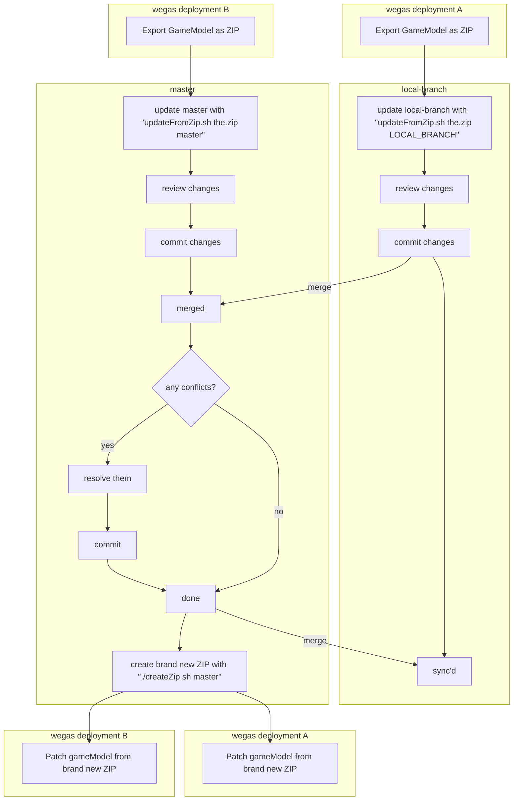

# Repository

## Update a branch from wegas

Download the zip from Wegas (Gamemodel settings -> "export" tab -> ZIP).
Then, run `./updateFromZip.sh <EXPORT.zip> [BRANCH_NAME]`.

## Update gamemodel in wegas

1. Run `createZip.sh`.
1. patch gameModel (Gamemodel settings -> "export" tab -> ZIP).

## Merge branches

